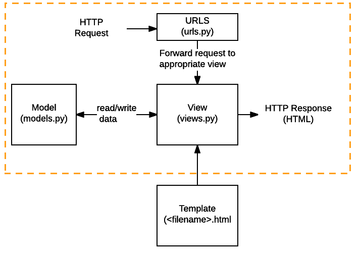

# 使用說明

## Backend 
```shell
cd backend
source env/bin/activate #啟動虛擬環境 for mac
venv/lunch/Scripts/activate.bat #啟動虛擬環境 for windows
```

成功的話，command prompt 前面應該會多出 (lunch) 的字樣，代表已經進入這個虛擬環境。如果未來你想退出這個虛擬環境，可以輸入 deactivate。接著輸入所需套件。

```shell
pip install django
pip install djangorestframework
pip install psycopg2 #python module for PostgreSQL
python -m pip install django-cors-headers #允許前端port3000的請求
python manage.py runserver #啟用後端server
```


## Frontend
```shell
cd frontend
yarn start
```

## Database

下載 [PostgreSQL 13](https://www.postgresql.org/download/) 以及 [pdAdmin](https://www.pgadmin.org/)(GUI介面)

* [Postgres setup on MacOS](https://www.youtube.com/watch?v=EZAa0LSxPPU)
* [匯入/匯出現有資料庫 by pdAdmin](https://www.youtube.com/watch?v=C30q5i1e9KE)


# API
- **討論文件**：[連結](https://hackmd.io/_vPVxhaGRT6TIeWEMzvgWA)
- **API endpoint**: http://127.0.0.1:8000/api
- **三個接口**
    >GET /stations

    >POST /timetable/search

    >POST /ticket/search


## Tutorial
##  Backend

### 後端架構
```
|-- backend
    |-- manage.py
    |-- env
    |-- filter
    |   |-- __init__.py
    |   |-- admin.py
    |   |-- apps.py
    |   |-- models.py
    |   |-- serializers.py
    |   |-- tests.py
    |   |-- urls.py
    |   |-- views.py
    |-- THSR
    |   |-- __init__.py
    |   |-- asgi.py
    |   |-- settings.py
    |   |-- urls.py
    |   |-- wsgi.py
```

### 模型定義 filter/models.py
```
class Fare(models.Model):
    # Fields
    fare_id = models.AutoField(primary_key=True)
    origin_station = models.ForeignKey('Station', on_delete=models.CASCADE, related_name='origin')
    destination_station = models.ForeignKey('Station', on_delete=models.CASCADE, related_name='destination')
    business_fare = models.FloatField()
    standard_fare = models.FloatField()
    non_reserved_fare = models.FloatField()
    
    # Metadata
    class Meta:
        db_table = 'fare'
    
    # Methods
    def __str__(self):
        return '{start}2{end}_fare'.format(start=origin_station, end=destination_station)
```

#### Field 欄位
設定欄位資料類型、參數、限制式等等。命名習慣為小寫加底線。

#### 常見欄位資料類型
`CharField`, `TextField`, `IntegerField`, `DateField`, `DateTimeField`, `EmailField`, `FileField`, `ImageField`, `AutoField`, `ForeignKey`, `ManyToManyField` ... 
[官方文件](https://docs.djangoproject.com/en/3.2/ref/models/fields/#field-types)

#### 常見欄位參數
- default :該欄位的默認值。
- null : 如為 `True`，即允許 Django 於資料庫該欄位寫入 `NULL`（但欄位型態如為 CharField 則會寫入空字串）。預設值是 `False`。
- blank: 如為 `True`，即允許該欄位的值允許空白。
- on_delete: `ForeignKey` 及 `ManyToManyField` 資料型態用到。代表的是當相關聯的類別被刪除之後，這些關聯到別人的資料要怎麼被處理。例如：`CASCADE` 表示相關聯的 key 被刪掉該欄位也要被刪掉（當此車站不見其關聯的費用也要刪掉）。
- related_name: `ForeignKey` 及 `ManyToManyField` 資料型態用到。Django 會自動創建一個反向關係，此名稱為從相關對像到這個對象的關係的名稱。不要反向關係就將該值設為`+`。
- ...(略)
[官方文件](https://docs.djangoproject.com/en/3.2/ref/models/fields/#field-options)

#### Metadata 元數據
Metadata 的意思是「描述其他數據的數據（data about data）」。常見的 meta option 有：
-  db_table: 對應到資料庫的資料表名稱。（如果想要將現有資料庫自動轉成 Django 模型請見：[官方說明](https://docs.djangoproject.com/en/3.2/howto/legacy-databases/)）
- ordering: 查詢時預設的排序方式。例如 `ordering = ['business_fare', '-standard_fare']` 就會先升冪排商務車廂票價再降冪排標準車廂票價.
[官方文件](https://docs.djangoproject.com/en/3.2/ref/models/options/)

#### Methods 方法
最起碼，在每個模型中，你應該定義標準的Python 類方法[__str__()](https://docs.python.org/3/reference/datamodel.html#object.__str__) ，來為每個物件返回一個人類可讀的字符串。這是 Python 用來把物件轉換成 str 的 hook；因為做網站時，常常需要把東西變成字串，所以這會很方便。


### 視圖 filter/views.py

當 Django 收到一個 HTTP request 時，會首先確認該 request 的 URI 應該對應到哪個 view（如果對應不到，直接回傳 404 Not Found），並把 request 交給它。View 要負責處理這個 request，並回傳一個 HTTP response。



### 定義資源 filter/urls.py

### 定義資源 filter/serializers.py